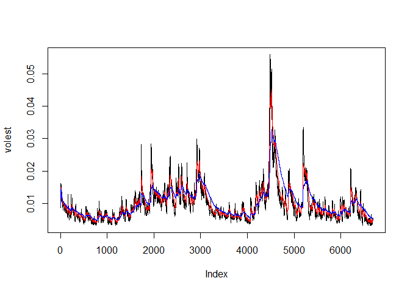

# S&P 500
M Nepal  
July 16, 2017  


## R Code


```r
##Financial Series
#install.packages("tseries")
library(tseries)
SNPdata <- get.hist.quote('^gspc',quote = "Close")
```

```
## 'getSymbols' currently uses auto.assign=TRUE by default, but will
## use auto.assign=FALSE in 0.5-0. You will still be able to use
## 'loadSymbols' to automatically load data. getOption("getSymbols.env")
## and getOption("getSymbols.auto.assign") will still be checked for
## alternate defaults.
## 
## This message is shown once per session and may be disabled by setting 
## options("getSymbols.warning4.0"=FALSE). See ?getSymbols for details.
```

```
## 
## WARNING: There have been significant changes to Yahoo Finance data.
## Please see the Warning section of '?getSymbols.yahoo' for details.
## 
## This message is shown once per session and may be disabled by setting
## options("getSymbols.yahoo.warning"=FALSE).
```

```
## time series ends   2017-07-14
```

```r
length(SNPdata)
```

```
## [1] 6686
```

```r
SNPret <- log(lag(SNPdata))-log(SNPdata)
length(SNPret)
```

```
## [1] 6685
```

```r
SNPvol <- sd(SNPret)* sqrt(250)*100
SNPvol
```

```
## [1] 17.72151
```

```r
##Volatility get
Vol <- function(d,logrets){
  var = 0
  lam = 0
  varlist <- c()
  for (r in logrets){
    lam = lam *(1-1/d)+1
    var = (1-1/lam)*var +(1/lam)*r^2
    varlist <- c(varlist,var)
  }
  sqrt(varlist)
}
volest <- Vol(10,SNPret)
volest2 <- Vol(30,SNPret)
volest3 <- Vol(100,SNPret)
```

## Including Plots

```r
plot(volest,type = "l")

lines(volest2,type = "l",col="red")
lines(volest3,type = "l",col="blue")
```

<!-- -->

